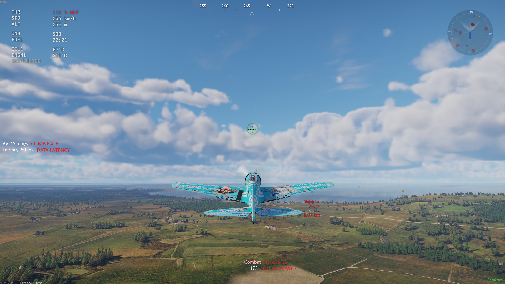

# War Thunder UI overlay

### Lightweight War Thunder overlay with extra data from the API

- Flaps state
- Engine power
- Climb rate

When War Thunder window is not focused, the overlay will be hidden. It will automatically come back up when the War Thunder window is focused. The overlay process can be run in the background safely, but you can stop it from the tray menu:

## Download
No releases currently being published. TODO !

## Development
Uses WPF with .NET 10. Install that and debug while running War Thunder (menu is fine) to see the overlay. Also possible to see the overlay when War Thunder isn't focused by tweaking UnfocusedWindowSize.

### Publish
just `dotnet publish -c Release`

## Known issues
- The War Thunder window is detected based on the title. If any language titles the window anything other than starting with "War Thunder", the overlay will not show itself. Not sure if any language actually does this